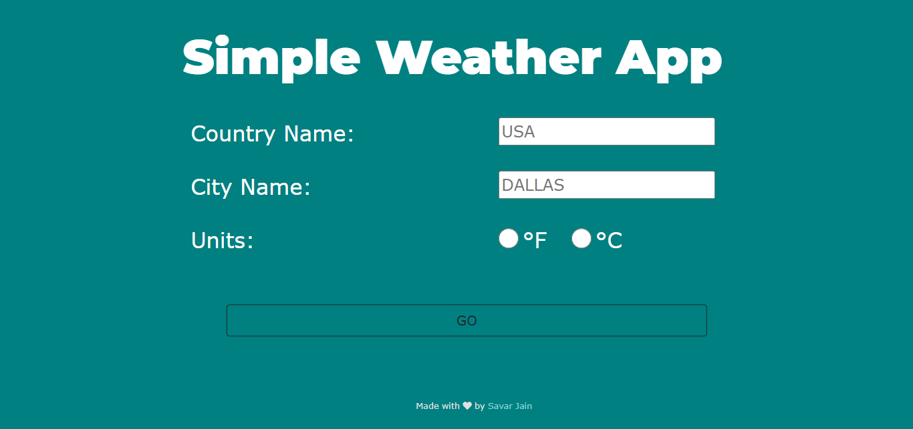
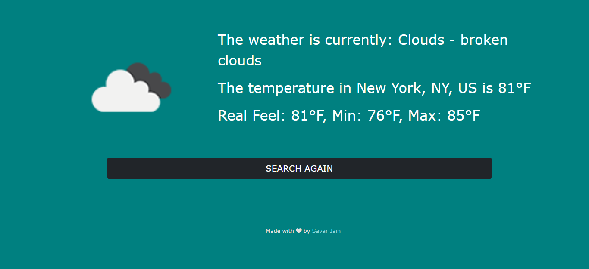

# Simple Weather App

A simple yet fully responsive weather app that will display the weather and current, min, max, and real feel temperature.

## Table of Contents

- [Deployment](#deployment)
- [Built With](#built-with)
- [Requirements](#requirements)
- [Install](#install)
- [Author(s)](#authors)
- [License](#license)
- [Acknowledgement](#acknowledgement)

 

## Deployment

**[Live Demo: https://savarj-weather.herokuapp.com/](https://savarj-weather.herokuapp.com/)**

 

 

## Built With

- [HTML](https://developer.mozilla.org/en-US/docs/Web/HTML)
- [CSS](https://developer.mozilla.org/en-US/docs/Web/CSS)
- [Bootstrap](https://getbootstrap.com/docs/5.0/getting-started/introduction/)
- [Javascript](https://developer.mozilla.org/en-US/docs/Web/JavaScript)
- [Node.js](https://nodejs.org/en/docs/)
- [Express.js](https://expressjs.com/en/5x/api.html)
- [EJS](https://ejs.co/)
- [OpenWeather API](https://openweathermap.org/api)

## Requirements

For development, you will only need Node.js and a node global package, NPM, installed in your environement.

### Node

- #### Node installation on Windows

  Just go on [official Node.js website](https://nodejs.org/) and download the installer. Also, be sure to have `git` available in your PATH, `npm` might need it (You can find git [here](https://git-scm.com/)).

If the installation was successful, you should be able to run the following command.

    $ node --version
    v14.17.0

    $ npm --version
    6.14.13

## Install

    $ git clone https://github.com/SavarJ/weather.git
    $ cd weather
    $ npm install

### Updating .env

Rename `.env.sample` to `.env` with the appropriate information

### Running the project

    $ npm start

## Author(s)

- **[Savar Jain](https://jainsavar.com)**

## License

Copyright (c) 2021 Savar Jain

Licensed under the [MIT License](LICENSE)

## Acknowledgement

- Challenge Project of The Complete 2021 Web Development Bootcamp by Dr. Angela Yu with some twists/changes
